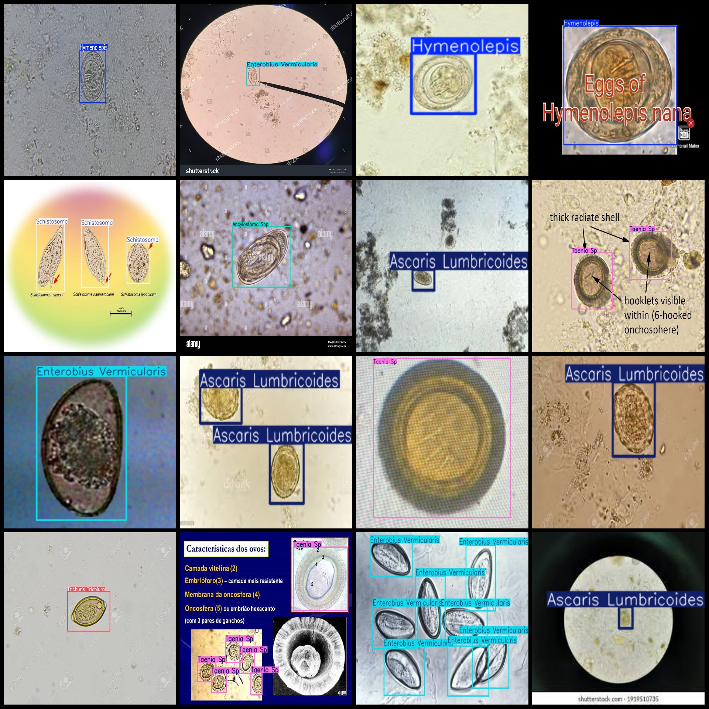
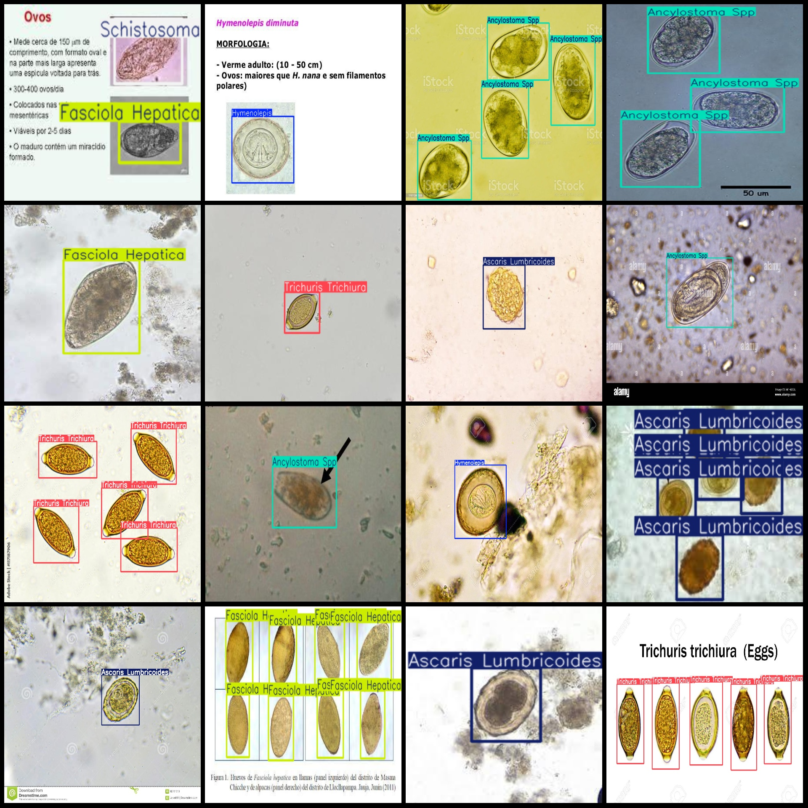

# Parasite Detection Dataset: VOC+YOLO with 8 Classes of 2109 Images

Dataset format: Pascal VOC format + YOLO format (txt file without split path, only containing jpg images and corresponding VOC format xml files and yolo format txt files)
Number of images (number of jpg files): 2109
Number of annotations (number of xml files): 2109
Number of annotations (number of txt files): 2109
Number of category labels: 8
Category label names according to the order in yolo format (and not in this correspondence, but as per "labels" folder's "classes.txt"): ["Ancylostoma Spp", "Ascaris Lumbricoides", "Enterobius Vermicularis", "Fasciola Hepatica", "Hymenolepis", "Schistosoma", "Taenia Sp", "Trichuris Trichiura"]
Box count for each category annotation:
- Ancylostoma Spp (hookworm genus) box count = 680
- Ascaris Lumbricoides box count = 676
- Enterobius Vermicularis (roundworm/pinworm) box count = 903
- Fasciola Hepatica (hepatobilharzia) box count = 492
- Hymenolepis (hymenolepis species) box count = 472
- Schistosoma (schistosomiasis spp) box count = 569
- Taenia Sp (taenia species) box count = 654
- Trichuris Trichiura (trichuriasis trichiurae) box count = 636
total boxes: 5082  
Image resolution: Multi-resolution images, such as 1280x720, 225x225, etc.
Use annotation tool: labelImg
Annotation rules: draw a rectangle box around the class.
Important notes: The dataset does not have separate training, validation, and test sets; you need to partition them yourself.
Special statement: This dataset does not guarantee the accuracy of the trained models or weight files.
Preview of images:
Annotation example:
## Images

Here is a pay link on Stripe ( https://buy.stripe.com/3cs8yP7sY87d0vu9AB ). Please contact me lonlonago@foxmail.com after funding $89, and I will send you a complete data files , thank you!

